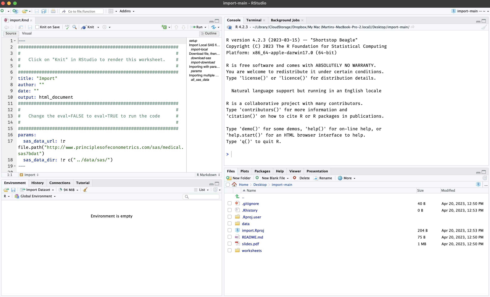

<!-- README.md is generated from README.Rmd. Please edit that file -->

```{r, include = FALSE}
knitr::opts_chunk$set(
  collapse = TRUE,
  comment = "#>",
  fig.path = "man/figures/README-",
  out.width = "100%"
)
```

# pdg

<!-- badges: start -->
<!-- badges: end -->

The goal of `pdg` is to load lessons developed by Paradigm Data Group, LLC.

## Installation

You can install the development version of `pdg` from [GitHub](https://github.com/) with:

``` r
# install.packages("remotes")
remotes::install_github("mjfrigaard/pdg")
```

## Example

To use a course, select one from the available repos: 

```{r, eval=FALSE}
library(pdg)
pdg::use_lesson("import")
```

```
Downloading into '/Users/mjfrigaard/Desktop/'.
Prefer a different location? Cancel, try again, and specify `destdir`
OK to proceed?

1: Not now
2: Absolutely
3: No
```

Make your selection (or try again with a `destdir` folder)

```
Selection: 2
✔ Downloading from 'https://github.com/paradigmdatagroup/import/archive/refs/heads/main.zip'
Downloaded: 0.89 MB  
✔ Download stored in '/Users/mjfrigaard/Desktop/import-main.zip'
✔ Unpacking ZIP file into 'import-main/' (18 files extracted)
Shall we delete the ZIP file ('import-main.zip')?

1: No
2: Yes
3: Negative
```

Keep or delete the zip file? 

```
Selection: 2
✔ Deleting 'import-main.zip'
✔ Opening project in RStudio
```

## Lesson materials 

```{r use_lesson_new, echo=FALSE, fig.align='center', out.width='100%'}

```


